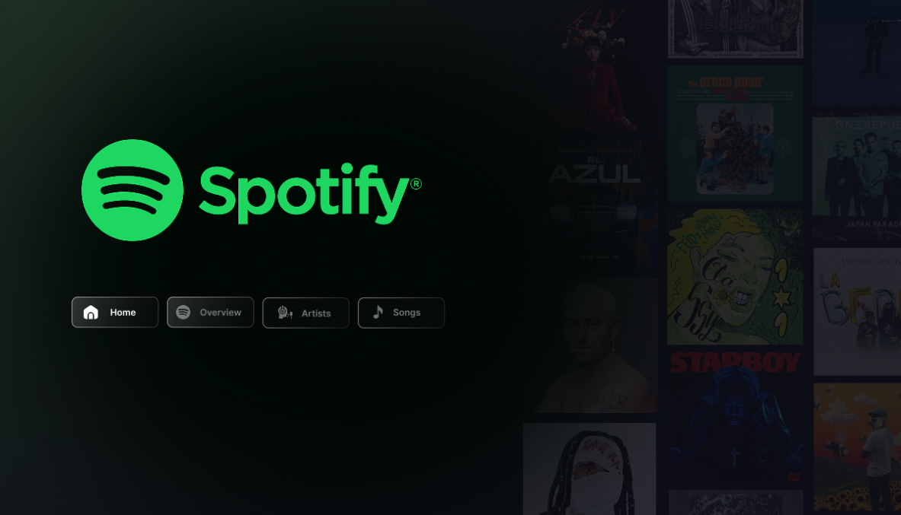
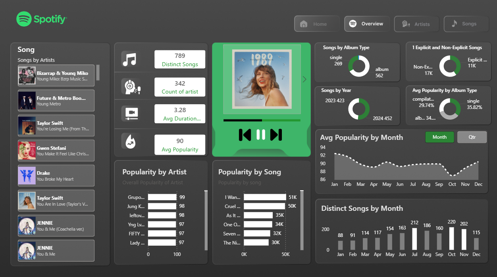
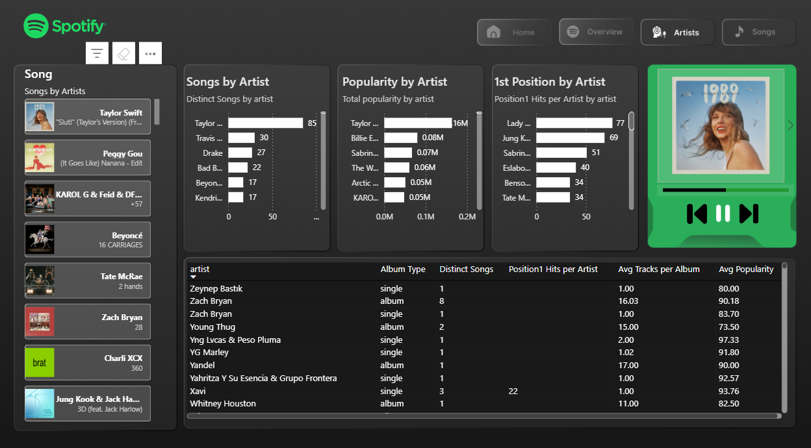
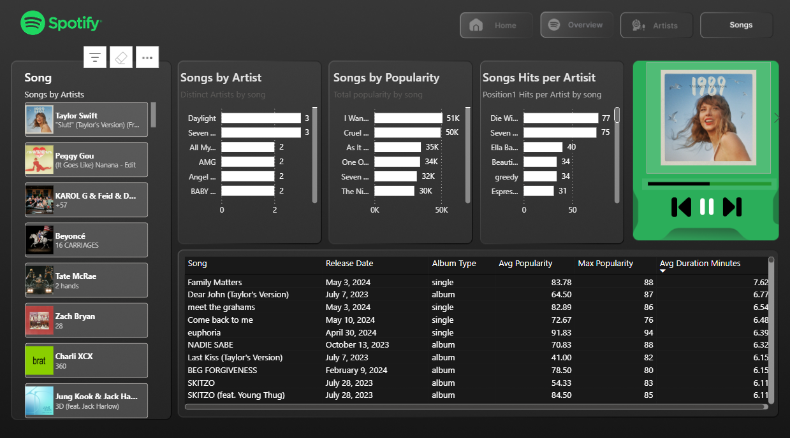

# Spotify Analytics Dashboard

<table>
  <tr>
    <td width="50%">
      
    </td>
    <td width="50%">
      
    </td>
  </tr>
  <tr>
    <td width="50%">
      
    </td>
    <td width="50%">
      
    </td>
  </tr>
</table>

---

## Project Overview

This Power BI project transforms raw music data into an interactive experience similar to the Spotify app itself. It allows users to explore the performance of top songs, analyze artist consistency, and uncover trends in popularity over time.

The goal was to build a tool that isn't just functional, but also intuitive and familiar to anyone who listens to music.

---

## The Data

The analysis is built on a Top-50 style dataset. It captures the essential DNA of a track:
*   **Core Metadata**: Song Name, Artist, Album Type (Single vs Album), and Release Date.
*   **Performance Metrics**: Popularity Score, Chart Position, and Duration.
*   **Content Flags**: Explicit vs. Non-Explicit ratings.

This structure enables us to slice the data in two main ways: looking at the **career arc of an Artist**, or zooming in on the **success of individual Songs**.

---

## visual Walkthrough

### 1. Home Page
Designed to mimic the actual Spotify mobile interface, this landing page handles navigation. It sets the visual tone immediately—dark mode, clean typography, and familiar icons.

### 2. Overview
The high-level executive summary. This page aggregates the chaos of individual rows into clear trends. We can see the split between Singles and Albums, the ratio of explicit content, and the seasonal ebbs and flows of music popularity across the year.

### 3. Artist Intelligence
A deep dive into the creators. Who produces the most hits? Who relies on singles versus full albums? This view ranks artists by their total reach and chart dominance, helping to identify the true heavyweights in the dataset.

### 4. Song Lab
Granular details at the track level. This table allows us to sort through the noise to find the longest songs, the most viral hits, and the hidden gems. It’s perfect for answering specific questions like "What was the most popular non-explicit song of 2023?"

---

## Why This Matters

Raw data is often boring; music isn't. This project bridges that gap. By applying a consumer-grade UI to standard analytics, it demonstrates that business intelligence doesn't have to look like a spreadsheet. It shows how design and data can work together to tell a story that people actually want to read.
# Spotify-Analysis-PowerBI-Dashboard
